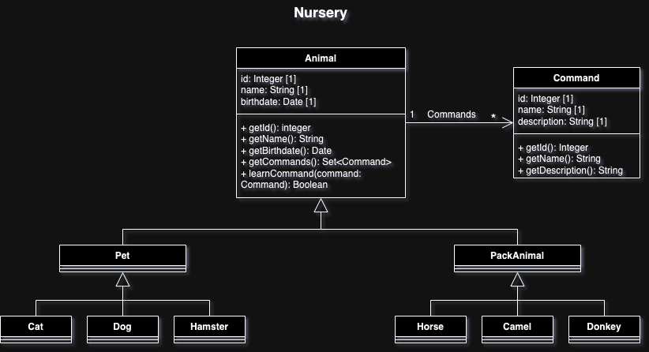
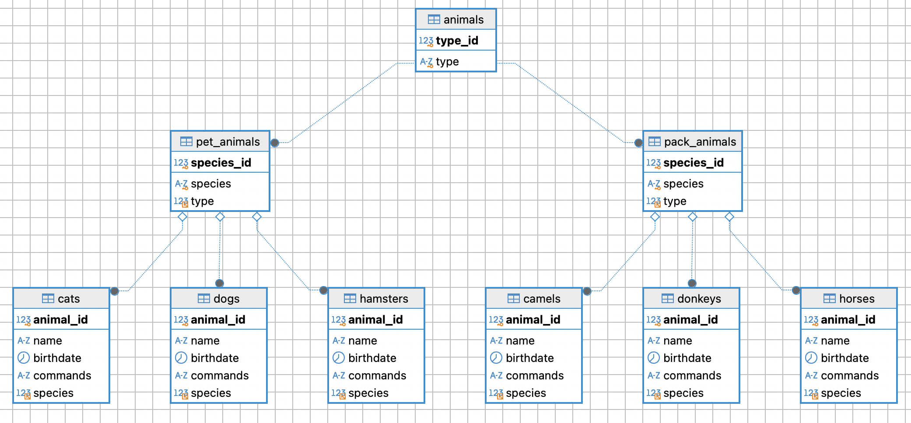
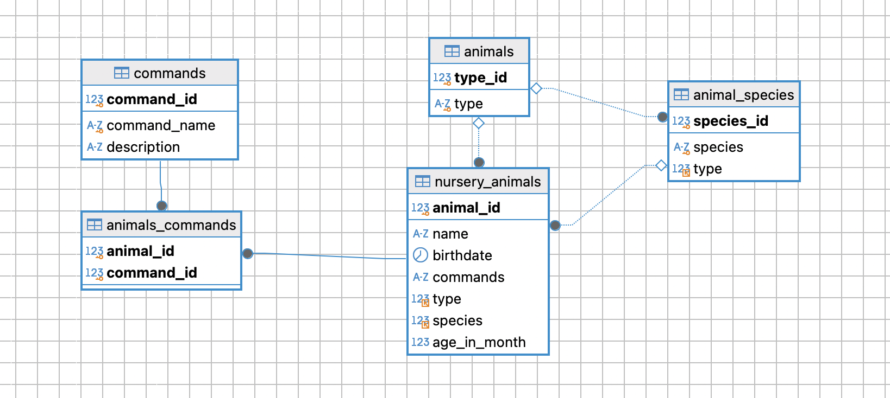

## Система учета для питомника в котором живут домашние и вьючные животные

### Подготовка среды
1. Устанавливаем VirtualBox на хостовую машину Mac OS (Sonoma)
2. Устанавливаем дитстрибутив Linux - Ubuntu-desktop 24.04
3. Конфигурируем сеть в настройках виртуальной машины на тип подключения NAT и перенаправаляем порты для подключения по SSH с хостовой машины
4. Устанавливаем систему контроля версий git и SSH. Генерируем ключи для Ubuntu и добавляем публичный ключ в рабочий аккаунт GitHub
5. Подключаемся к гостевой ОС по SSH
6. *Опционально можно сконфигурировать клиентскую и серверную машину на проброс X11 сервера для работы с удаленным дисплеем

```shell
alex@iMac-IMAC ~ % ssh -p 8022 alex@localhost
alex@localhost\'s password:
alex@alex-VirtualBox:~$
``` 
`alex@alex-VirtualBox:/...$` далее `~$`

Создание рабочей директории проекта, локального репозитория системы контроля версий и подключение удаленного репозитория

```shell
~$ mkdir GeekBrains_prog_spec_final_test
~$ cd ./GeekBrains_prog_spec_final_test/
~/GeekBrains_prog_spec_final_test$ git init
```

Создаем README.md и делаем инициализирующий коммит, переименовываем главную ветку в main

```shell
~$ echo "# gb_programming_specialization_final_test" >> README.md
~$ git add README.md
~$ git branch -M main
~$ git remote add origin git@github.com:Aberezhnoy1980/gb_programming_specialization_final_test.git
~$ git push -u origin main
~$ git checkout -b files_creating
```

Создаем ветку для работы с текущим заданием и переходим на нее

## Операционные системы и виртуализация (Linux)

### 1. Использование команды cat в Linux
- Создать два текстовых файла: "Pets"(Домашние животные) и "Pack animals"(вьючные животные), используя команду `cat` в терминале Linux. 
В первом файле перечислить собак, кошек и хомяков. Во втором — лошадей, верблюдов и ослов.

```shell
~$ cat > Pets
~$ cat > Pack_animals
```
- Объединить содержимое этих двух файлов в один и просмотреть его содержимое.
- Переименовать получившийся файл в "Human Friends"
  
```shell
~$ cat Pets Pack_animals > Human_friends
~$ cat Human_friends
~$ ls -lh
итого 16K
-rw-rw-r-- 1 alex alex 1,2K авг  5 17:07 Human_friends
-rw-rw-r-- 1 alex alex  607 авг  5 16:53 Pack_animals
-rw-rw-r-- 1 alex alex  608 авг  5 17:05 Pets
-rw-rw-r-- 1 alex alex   43 авг  5 14:12 README.md
```

### 2. Работа с директориями в Linux
- Создать новую директорию и переместить туда файл "Human Friends".

```shell
~$ mkdir animals && mv Human_friends ./animals
```

Для удобства установим утилиту tree (sudo apt install tree)
```shell
~/GeekBrains_prog_spec_final_test$ tree
.
├── animals
│	 └── Human_friends
├── Pack_animals
├── Pets
└── README.md

2 directories, 4 files
```

Делаем коммит, пушим изменения, создаем ПР, мерджим ветки и удаляем текущую

### 3. Работа с MySQL в Linux. “Установить MySQL на вашу вычислительную машину ”
- Подключить дополнительный репозиторий MySQL и установить один из пакетов из этого репозитория.

Создадим и добавим ключ GnuPG. Создадим в корне файл `mysql_pubkey.asc` и вставим публичную часть ключа скопированную с оф сайта документации mysql (предварительно установив редактор vim и проверив утилиту gpg (`gpg --help`))

```shell
~$ cd ~
~$ vim mysql_pubkey.asc
```

Импортируем ключ в связку ключей GnuPG

`~$ gpg --import mysql_pubkey.asc`

Добавим ключ в связку ключей GnuPG

`~$ sudo apt-key add ./mysql_pubkey.asc`

Подключим репозиторий mysql вручную путем создания файла `mysql.list` в директории `/etc/apt/sourses.list.d`

`~$ cat /etc/apt/sources.list.d/mysql.list`

Версия ubuntu - 24.04 LTS noble (проверяем codename версии `cat /etc/os-release`.)

`deb http://repo.mysql.com/apt/ubuntu/ noble mysql-8.0 mysql-tools`

Обновыим информацию о пакете из репозитория

`~$ sudo apt update`

Устанавливаем сервер БД

`sudo apt install mysql-server`

Проверяем подключение и получаем приглашение сервера. Проверяем базы данных

```shell
~$ mysql -u root -p 
Enter password: 
Welcome to the MySQL monitor.  Commands end with ; or \g.
Your MySQL connection id is 9
Server version: 8.0.39 MySQL Community Server - GPL

Copyright (c) 2000, 2024, Oracle and/or its affiliates.

Oracle is a registered trademark of Oracle Corporation and/or its
affiliates. Other names may be trademarks of their respective
owners.

Type 'help;' or '\h' for help. Type '\c' to clear the current input statement.

mysql> show databases;
+--------------------+
| Database           |
+--------------------+
| information_schema |
| mysql              |
| performance_schema |
| sys                |
+--------------------+
4 rows in set (0,00 sec)
```

### 4. Управление deb-пакетами
- Установить и затем удалить deb-пакет, используя команду `dpkg`.

Скачиваем пакет (для примера connector)

`~$ sudo apt download mysql-connector-j`

Проверяем файл

```shell
~$ ll | grep mysql-c
-rw-r--r--  1 root root 2522418 июн 28 05:23 mysql-connector-j_9.0.0-1ubuntu24.04_all.deb
```

Устанавливаем пакет с помощью менеджера dpkg

`~$ sudo dpkg -i mysql-connector-j_9.0.0-1ubuntu24.04_all.deb`

Удаляем пакет 

```shell
~$ sudo dpkg -r mysql-connector-j && sudo apt autoremove
~$ rm mysql-connector-j_9.0.0-1ubuntu24.04_all.deb
```

Создаем новую ветку для записи истории команд в файл и добавления файла в проект

```shell
~$ cd ./GeekBrains_prog_spec_final_test/
$ git checkout -b command_list_and_mysql_task
```

### 5. История команд в терминале Ubuntu
- Сохранить и выложить историю ваших терминальных команд в Ubuntu.
В формате: Файла с ФИО, датой сдачи, номером группы(или потока)

Перенаправим вывод команды history в файл (можно использоваать ключи, например -anrw)

```shell
~$ history > Berezhnoy_A_09082024_5449
~$ ls -l ./GeekBrains_prog_spec_final_test
```

Фиксируем изменения в системе контроля версий (далее отдельные ветки создавать не будем, коммитить будем ветку main (разработчик один и потребности в Pull request пока нет))

## Объектно-ориентированное программирование 

### 6. Диаграмма классов
- Создать диаграмму классов с родительским классом "Животные", и двумя подклассами: "Pets" и "Pack animals".
В составы классов которых в случае Pets войдут классы: собаки, кошки, хомяки, а в класс Pack animals войдут: Лошади, верблюды и ослы.
Каждый тип животных будет характеризоваться (например, имена, даты рождения, выполняемые команды и т.д)
Диаграмму можно нарисовать в любом редакторе, такими как Lucidchart, Draw.io, Microsoft Visio и других.

Нарисуем диаграмму с помощью вэб-сервиса draw.io и импортируем изображение в папку проекта. 



Зафиксируем добавленый артефакт в системе контроля версий

```shell
~$ cp ~/shared/Nursery_class_diagram.drawio ./img
~$ cp ~/shared/Nursery_class_diagram.png ./img
~$ ls -l ./img
итого 132
-rwxrwx--- 1 alex alex  15948 сен 19 11:01 Nursery_class_diagram.drawio
-rwxrwx--- 1 alex alex 117164 сен 19 11:02 Nursery_class_diagram.png
~$ git add -A; git commit -m"class diagram adedd"; git push origin main
 ```

### 7. Работа с MySQL (Задача выполняется в случае успешного выполнения задачи “Работа с MySQL в Linux. “Установить MySQL на вашу машину”)

После создания диаграммы классов в 6 пункте, в 7 пункте база данных "Human Friends" должна быть структурирована в соответствии с этой диаграммой. Например, можно создать таблицы, которые будут соответствовать классам "Pets" и "Pack animals", и в этих таблицах будут поля, которые характеризуют каждый тип животных (например, имена, даты рождения, выполняемые команды и т.д.). 

В ранее подключенном MySQL создать базу данных с названием "Human Friends".
- Создать таблицы, соответствующие иерархии из вашей диаграммы классов.
- Заполнить таблицы данными о животных, их командах и датами рождения.
- Удалить записи о верблюдах и объединить таблицы лошадей и ослов.
- Создать новую таблицу для животных в возрасте от 1 до 3 лет и вычислить их возраст с точностью до месяца.
- Объединить все созданные таблицы в одну, сохраняя информацию о принадлежности к исходным таблицам.

Вот здесь есть разночтения в ТЗ в части создания таблиц: в тексте сказано создавать таблицы согласно диагрммы классов в том числе один из  пунктов явно указывает "..Удалить записи о верблюдах и объединить **ТАБЛИЦЫ** лошадей и ослов.", то есть у каждого вида животного есть своя таблица (коты, собаки и пр.), однако в примере минимальная таблица на уровне типа животного (домашние, вьючные) с указанием вида в кортеже (кот, собака и т.д.). 
Запускаем mysql cli и получаем приглашение сервера:

```shell
~$ mysql -u root -p
mysql> show databases;
+--------------------+
| Database           |
+--------------------+
| information_schema |
| mysql              |
| performance_schema |
| sys                |
+--------------------+
4 rows in set (0,00 sec)
```

Создаю БД
```sql
DROP DATABASE IF EXISTS `human_friends`;
CREATE DATABASE `human_friends`;
```

Делаю созданную БД активной для работы с ней (можно не обращаться к БД через оператор точка)

```sql
USE human_friends;
```


Создаю таблицу-справочник с типами животных. **Класс Animal**

```sql
DROP TABLE IF EXISTS `animals`;
CREATE TABLE `animals` (
	`type_id` SERIAL PRIMARY KEY, -- SERIAL is an aliace for BIGINT UNSIGNED NOT NULL AUTO_INCREMENT UNIQUE.
	`type` ENUM("pet_animal", "pack_animal") NOT NULL UNIQUE
);
```

Создаю таблицу-справочник с типами животных. Класс Pet_animal. Для отображение иерархии приходится без очевидной необходимости держать идентификатор типа. То есть таблица содержит ссылку на саму себя

```sql
DROP TABLE IF EXISTS `pet_animals`;
CREATE TABLE `pet_animals` (
	`species_id` SERIAL PRIMARY KEY, -- SERIAL is an aliace for BIGINT UNSIGNED NOT NULL AUTO_INCREMENT UNIQUE.
	`species` ENUM("cat", "dog", "hamster") NOT NULL UNIQUE,
	`type` BIGINT UNSIGNED NOT NULL DEFAULT 1,
	FOREIGN KEY (`type`) REFERENCES `animals`(`type_id`)
);
```

То же самое для класса pack_animal

```sql
DROP TABLE IF EXISTS `pack_animals`;
CREATE TABLE `pack_animals` (
	`species_id` SERIAL PRIMARY KEY, -- SERIAL is an aliace for BIGINT UNSIGNED NOT NULL AUTO_INCREMENT UNIQUE.
	`species` ENUM("horse", "camel", "donkey") NOT NULL UNIQUE,
	`type` BIGINT UNSIGNED NOT NULL DEFAULT 2,
	FOREIGN KEY (`type`) REFERENCES `animals`(`type_id`)
);
```

Заполняю таблицы спсравочными значениями

```sql
INSERT INTO `animals`(`type`) VALUES ("pet_animal"), ("pack_animal");
INSERT INTO `pet_animals`(`species`) VALUES ("cat"), ("dog"), ("hamster");
INSERT INTO `pack_animals`(`species`) VALUES ("horse"), ("camel"), ("donkey");
```

Создаю низкоуровневые таблицы для каждого вида животного через процедуру
```sql
DROP PROCEDURE IF EXISTS table_creator;
DELIMITER $$
CREATE PROCEDURE table_creator() 
BEGIN
	DECLARE n INT DEFAULT 0;
	DECLARE i INT DEFAULT 0;
	DECLARE species_id BIGINT;
    DECLARE table_name VARCHAR(15);
   	DECLARE cursor_pet_species CURSOR FOR (SELECT `species` FROM `pet_animals`);
   	DECLARE cursor_pack_species CURSOR FOR (SELECT `species` FROM `pack_animals`);
   	OPEN cursor_pet_species;
    OPEN cursor_pack_species;
    SET n = (SELECT COUNT(*) FROM `pet_animals`);
	SET i = 0;
    WHILE i < n DO
	    FETCH cursor_pet_species INTO table_name;
	    SET @createTab=CONCAT("CREATE TABLE ", table_name, "s", " (`animal_id` SERIAL PRIMARY KEY, 
																	`name` varchar(50) NOT NULL,	
																	`birthdate` DATE NOT NULL, 
																	`commands` TEXT, 
																	`species` BIGINT UNSIGNED DEFAULT ", i + 1, ", 
																	FOREIGN KEY (`species`) REFERENCES `pet_animals`(`species_id`))");
	    PREPARE stmtCreate FROM @createTab;
		EXECUTE stmtCreate;
	    SET i = i + 1;
	END WHILE;
	CLOSE cursor_pet_species;
    SET n = (SELECT COUNT(*) FROM `pack_animals`);
   	SET i = 0;
    WHILE i < n DO
	    FETCH cursor_pack_species INTO table_name;
	    SET @createTab=CONCAT("CREATE TABLE ", table_name, "s", " (`animal_id` SERIAL PRIMARY KEY, 
																	`name` varchar(50) NOT NULL,	
																	`birthdate` DATE NOT NULL, 
																	`commands` TEXT, 
																	`species` BIGINT UNSIGNED DEFAULT ", i + 1, ", 
																	FOREIGN KEY (`species`) REFERENCES `pack_animals`(`species_id`))");
	    PREPARE stmtCreate FROM @createTab;
		EXECUTE stmtCreate;
	    SET i = i + 1;
	END WHILE;
	CLOSE cursor_pack_species;
END 
$$
DELIMITER ;

CALL table_creator();
```

Заполняю таблицы с видами животных
```sql
INSERT INTO `cats`(`name`, `birthdate`, `commands`) values ("Mursik", "2020-01-01", "Sit, Pounce"), ("Barsik", "2021-07-24", "Sit, Pounce, Scratch"), ("Tishka", "2022-09-03", "Meow, Scratch, Jump");
INSERT INTO `dogs`(`name`, `birthdate`, `commands`) values ("Sharik", "2020-01-01", "Sit, Stay, Fetch"), ("Tusik", "2021-07-24", "Sit, Paw, Bark"), ("Palkan", "2022-09-03", "Sit, Stay, Roll");
INSERT INTO `hamsters`(`name`, `birthdate`, `commands`) values ("Grizly", "2020-01-01", "Roll, Hide"), ("Kadzu", "2021-07-24", "Roll, Spin"), ("Shrilanka", "2022-09-03", "Roll");

INSERT INTO `horses`(`name`, `birthdate`, `commands`) values ("Talaya", "2020-01-01", "Trot, Canter, Gallop"), ("Gustaya", "2021-07-24", "Trot, Canter"), ("Princess", "2022-09-03", "Trot, Jump, Gallop");
INSERT INTO `camels`(`name`, `birthdate`, `commands`) values ("Prado", "2020-01-01", "Walk, Carry Load"), ("Gelik", "2021-07-24", "Walk, Sit"), ("Hammer", "2022-09-03", "Walk, Run");
INSERT INTO `donkeys`(`name`, `birthdate`, `commands`) values ("Drugshreka", "2020-01-01", "Walk, Carry Load, Bray"), ("Ea", "2021-07-24", "Walk, Bray, Kick"), ("Oslo", "2022-09-03", "Walk");
```

Структура таблиц после создания:


Удалив из таблицы верблюдов, т.к. верблюдов решили перевезти в другой питомник на зимовку. Объединить таблицы лошади, и ослы в одну таблицу.

```sql
DROP TABLE IF EXISTS `camels`;
```
```sql
DROP TABLE IF EXISTS`horses_donkeys`;
CREATE TABLE `horses_donkeys`
AS SELECT * FROM `horses`
UNION
SELECT * FROM `donkeys`;

ALTER TABLE `horses_donkeys`
ADD CONSTRAINT FOREIGN KEY (`species`) REFERENCES `pack_animals`(`species_id`);
```

Создать новую таблицу “молодые животные” в которую попадут все животные старше 1 года, 
но младше 3 лет и в отдельном столбце с точностью до месяца подсчитать возраст животных в новой таблице

```sql
DROP TABLE IF EXISTS `young_animals`;
CREATE TABLE `young_animals` (
	`animal_id`SERIAL PRIMARY KEY,
	`name`varchar(50) NOT NULL,
	`birthdate`DATE NOT NULL,
	`commands`TEXT,
	`type` BIGINT UNSIGNED,
	`species`BIGINT UNSIGNED,
	`age_in_month` INT
);  

INSERT INTO `young_animals` (`name`,	`birthdate`, `commands`, `type`, `species`, `age_in_month`)
SELECT `name`, `birthdate`, `commands`, 1 AS `type`, `species`, TIMESTAMPDIFF(MONTH, `birthdate`, CURDATE()) AS `age_in_month`
FROM `cats`
WHERE TIMESTAMPDIFF(MONTH, `birthdate`, CURDATE()) BETWEEN 12 AND 36
UNION ALL
SELECT `name`, `birthdate`, `commands`, 1 AS `type`, `species`, TIMESTAMPDIFF(MONTH, `birthdate`, CURDATE()) AS `age_in_month`
FROM `dogs`
WHERE TIMESTAMPDIFF(MONTH, `birthdate`, CURDATE()) BETWEEN 12 AND 36
UNION ALL
SELECT `name`, `birthdate`, `commands`, 1 AS `type`, `species`, TIMESTAMPDIFF(MONTH, `birthdate`, CURDATE()) AS `age_in_month`
FROM `hamsters`
WHERE TIMESTAMPDIFF(MONTH, `birthdate`, CURDATE()) BETWEEN 12 AND 36
UNION ALL
SELECT `name`, `birthdate`, `commands`, 2 AS `type`, `species`, TIMESTAMPDIFF(MONTH, `birthdate`, CURDATE()) AS `age_in_month`
FROM `horses_donkeys`
WHERE TIMESTAMPDIFF(MONTH, `birthdate`, CURDATE()) BETWEEN 12 AND 36;
```

Таблица `young_animals`:

```sql
SELECT * FROM `young_animals`;
+-----------+-----------+------------+----------------------+------+---------+--------------+
| animal_id | name      | birthdate  | commands             | type | species | age_in_month |
+-----------+-----------+------------+----------------------+------+---------+--------------+
|         1 | Tishka    | 2022-09-03 | Meow, Scratch, Jump  |    1 |       1 |           25 |
|         2 | Sharik    | 2021-12-01 | Sit, Stay, Fetch     |    1 |       2 |           34 |
|         3 | Tusik     | 2022-03-24 | Sit, Paw, Bark       |    1 |       2 |           31 |
|         4 | Palkan    | 2021-12-03 | Sit, Stay, Roll      |    1 |       2 |           34 |
|         5 | Grizly    | 2022-01-01 | Roll, Hide           |    1 |       3 |           33 |
|         6 | Shrilanka | 2022-05-03 | Roll                 |    1 |       3 |           29 |
|         7 | Talaya    | 2022-09-01 | Trot, Canter, Gallop |    2 |       1 |           25 |
|         8 | Princess  | 2023-05-03 | Trot, Jump, Gallop   |    2 |       1 |           17 |
|         9 | Oslo      | 2021-10-30 | Walk                 |    2 |       3 |           35 |
+-----------+-----------+------------+----------------------+------+---------+--------------+
9 rows in set (0,01 sec)
```

Немного модифицирую результат задания для следующей (приложение) задачи

```sql
DROP TABLE IF EXISTS `commands`; 
CREATE TABLE `commands` (
	`command_id` SERIAL PRIMARY KEY,
	`command_name` VARCHAR(50) NOT NULL UNIQUE,
	`description` TEXT
);

INSERT INTO `commands` (`command_name`, `description`) VALUES
("Sit", "desc"),
("Pounce", "desc"),
("Scratch", "desc"),
("Meow", "desc"),
("Jump", "Desc"),
("Stay", "desc"),
("Fetch", "desc"),
("Paw", "desc"),
("Bark", "desc"),
("Roll", "desc"),
("Hide", "desc"),
("Spin", "desc"),
("Trot", "desc"),
("Canter", "desc"),
("Gallop", "desc"),
("Walk", "desc"),
("Carry Load", "desc"),
("Bray", "desc"),
("Kick", "desc");

DROP TABLE IF EXISTS `animal_species`; 
CREATE TABLE `animal_species` (
	`species_id` SERIAL PRIMARY KEY,
	`species` VARCHAR(50) NOT NULL UNIQUE,
	`type` BIGINT  UNSIGNED,
	FOREIGN KEY (`type`) REFERENCES `animals`(`type_id`)
);

INSERT INTO `animal_species` (`species`, `type`) VALUES
("cat", 1),
("dog", 1),
("hamster", 1),
("horse", 2),
("camel", 2),
("donkey", 2);

DROP TABLE IF EXISTS `nursery_animals`;
CREATE TABLE `nursery_animals` (
	`animal_id`SERIAL PRIMARY KEY,
	`name`varchar(50) NOT NULL,
	`birthdate`DATE NOT NULL,
	`commands`TEXT,
	`type` BIGINT UNSIGNED,
	`species`BIGINT UNSIGNED,
	`age_in_month` INT NOT NULL,
	FOREIGN KEY (`type`) REFERENCES `animals`(`type_id`) ON DELETE CASCADE ON UPDATE CASCADE,
	FOREIGN KEY (`species`) REFERENCES `animal_species`(`species_id`) ON DELETE CASCADE ON UPDATE CASCADE
	);  

INSERT INTO `nursery_animals` (`name`,	`birthdate`, `commands`, `type`, `species`, `age_in_month`)
SELECT `name`, `birthdate`, `commands`, 1 AS `type`, `species`, TIMESTAMPDIFF(MONTH, `birthdate`, CURDATE()) AS `age_in_month`
FROM `cats`
UNION ALL
SELECT `name`, `birthdate`, `commands`, 1 AS `type`, `species`, TIMESTAMPDIFF(MONTH, `birthdate`, CURDATE()) AS `age_in_month`
FROM `dogs`
UNION ALL
SELECT `name`, `birthdate`, `commands`, 1 AS `type`, `species`, TIMESTAMPDIFF(MONTH, `birthdate`, CURDATE()) AS `age_in_month`
FROM `hamsters`
UNION ALL
SELECT `name`, `birthdate`, `commands`, 2 AS `type`, `species`, TIMESTAMPDIFF(MONTH, `birthdate`, CURDATE()) AS `age_in_month`
FROM `horses_donkeys`;

DROP TABLE IF EXISTS `animals_commands`;
CREATE TABLE `animals_commands` (
	`animal_id` BIGINT UNSIGNED,
	`command_id` BIGINT UNSIGNED,
	PRIMARY KEY (`animal_id`, `command_id`),
	FOREIGN KEY (`animal_id`) REFERENCES `nursery_animals`(`animal_id`),
	FOREIGN KEY (`command_id`) REFERENCES `commands`(`command_id`)
);

INSERT INTO `animals_commands` VALUES
(1, 1), (1, 2), (2, 1), (2, 2), (2, 3), (3, 4), (3, 3), (3, 5),
(4, 1), (4, 6), (4, 7), (5, 1), (5, 8), (5, 9), (6, 1), (6, 6), 
(6, 10), (7, 10), (7 ,11), (8, 10), (8, 12), (9, 10), (10, 13), 
(10, 14), (10, 15), (11, 13), (11, 14), (12, 13), (12, 5), (12, 15), 
(13, 16), (13, 17), (13, 18), (14, 16), (14, 18), (14, 19), (15, 16);
```

Удаляю ненужные таблицы с помощью функции

```sql
DELIMITER $$
CREATE PROCEDURE drop_tables_by_names(IN table_names TEXT)
BEGIN
    DECLARE table_name VARCHAR(255);
    DECLARE table_list TEXT;
    DECLARE query TEXT;
    SET table_list = table_names;
    SET @table_name = NULL;
    WHILE LENGTH(table_list) > 0 DO
        SET @table_name = SUBSTRING_INDEX(table_list, ',', 1);
        SET table_list = TRIM(BOTH ',' FROM SUBSTRING(table_list, LENGTH(@table_name) + 2));
        SET @query = CONCAT('DROP TABLE IF EXISTS ', @table_name);
        PREPARE stmt FROM @query;
        EXECUTE stmt;
        DEALLOCATE PREPARE stmt;
    END WHILE;
    SELECT 'Все таблицы успешно удалены' AS result;
END$$
DELIMITER ;

CALL drop_tables_by_names('cats,dogs,hamsters,horses,camels,donkeys,horses_donkeys,young_animals,pack_animals,pet_animals');
```

Итоговая структура базы данных: 



Установим Docker (для создания образа и развертывания будущего приложения в контейнере, а также настройки CI/CD pipeline)

`~$ sudo apt update`

Установим пакеты, которые позволят использовать репозиторий по HTTPS:

`~$ sudo apt install apt-transport-https ca-certificates curl software-properties-common`

Устновим официальный GPG-ключ Docker:

`~$ sudo mkdir -p /etc/apt/keyrings curl -fsSL https://download.docker.com/linux/ubuntu/gpg | sudo gpg --dearmor -o /usr/share/keyrings/docker-archive-keyring.gpg`

Добавим репозиторий Docker к списку источников пакетов:

`~$ echo "deb [signed-by=/usr/share/keyrings/docker-archive-keyring.gpg] https://download.docker.com/linux/ubuntu $(lsb_release -cs) stable" | sudo tee /etc/apt/sources.list.d/docker.list > /dev/null`

Обновим пакеты

`~$ sudo apt update`

Установим компоненты

`~$ sudo apt-get install docker-ce docker-ce-cli containerd.io docker-compose-plugin`

Добавим пользователя в группу docker, чтобы избежать использования sudo для запуска Docker команд:
```shell
~$ sudo usermod -aG docker $USER
~$ newgrp docker
~$ docker --version
```

Тестируем

`~$ sudo docker run hello-world`

Создаем директокрию проекта

### 8. ООП и Java

Подготовка среды исполнения - пишем программу в коммандной строке

Установим jdk

```shell
~$ sudo apt update
~$ sudo apt install openjdk-17-jdk
```

Установим сборщик Maven

```shell
~$ sudo apt install mvn
```

Проверим окружение

```shell
~$ mvn --version
Apache Maven 3.8.7
Maven home: /usr/share/maven
Java version: 17.0.12, vendor: Ubuntu, runtime: /usr/lib/jvm/java-17-openjdk-amd64
Default locale: ru_RU, platform encoding: UTF-8
OS name: "linux", version: "6.8.0-40-generic", arch: "amd64", family: "unix"
```

Создадим проект из архитепа в директори проекта

```shell
~$ mvn archetype:generate -DgroupId=ru.aberezhnoy \
-DartifactId=nursery \
-DarchetypeArtifactId=maven-archetype-quickstart \
-DarchetypeVersion=1.4 \
-DinteractiveMode=false
```

Посмотрим структуру проекта
```shell
~$ cd nursery/; tree
.
├── pom.xml
└── src
    ├── main
    │   └── java
    │       └── ru
    │           └── aberezhnoy
    │               └── App.java
    └── test
        └── java
            └── ru
                └── aberezhnoy
                    └── AppTest.java

10 directories, 3 files
```

Построим дерево зависимостей

```shell
~$ mvn dependency:tree
[INFO] Scanning for projects...
[INFO] 
[INFO] -----------------------< ru.aberezhnoy:nursery >------------------------
[INFO] Building nursery 1.0-SNAPSHOT
[INFO] --------------------------------[ jar ]---------------------------------
[INFO] 
[INFO] --- maven-dependency-plugin:2.8:tree (default-cli) @ nursery ---
[INFO] ru.aberezhnoy:nursery:jar:1.0-SNAPSHOT
[INFO] \- junit:junit:jar:4.11:test
[INFO]    \- org.hamcrest:hamcrest-core:jar:1.3:test
[INFO] ------------------------------------------------------------------------
[INFO] BUILD SUCCESS
[INFO] ------------------------------------------------------------------------
[INFO] Total time:  1.554 s
[INFO] Finished at: 2024-10-31T13:42:37+03:00
[INFO] ------------------------------------------------------------------------
```

Поробуем запустить шаблон

```shell 
~$ javac -d ./target/classes/ ./src/main/java/ru/aberezhnoy/App.java 
~$ java -cp ./target/classes/ ru.aberezhnoy.App
Hello World!
```

Попробуем скомпилировать проект с помощью maven

```shell
~$ mvn -DskipTests=true package
[INFO] Scanning for projects...
[INFO] 
[INFO] -----------------------< ru.aberezhnoy:nursery >------------------------
[INFO] Building nursery 1.0-SNAPSHOT
[INFO] --------------------------------[ jar ]---------------------------------
[INFO] 
[INFO] --- maven-resources-plugin:3.0.2:resources (default-resources) @ nursery ---
[INFO] Using 'UTF-8' encoding to copy filtered resources.
[INFO] skip non existing resourceDirectory /home/alex/GeekBrains_prog_spec_final_test/nursery/src/main/resources
[INFO] 
[INFO] --- maven-compiler-plugin:3.8.0:compile (default-compile) @ nursery ---
[INFO] Changes detected - recompiling the module!
[INFO] Compiling 1 source file to /home/alex/GeekBrains_prog_spec_final_test/nursery/target/classes
[INFO] 
[INFO] --- maven-resources-plugin:3.0.2:testResources (default-testResources) @ nursery ---
[INFO] Using 'UTF-8' encoding to copy filtered resources.
[INFO] skip non existing resourceDirectory /home/alex/GeekBrains_prog_spec_final_test/nursery/src/test/resources
[INFO] 
[INFO] --- maven-compiler-plugin:3.8.0:testCompile (default-testCompile) @ nursery ---
[INFO] Changes detected - recompiling the module!
[INFO] Compiling 1 source file to /home/alex/GeekBrains_prog_spec_final_test/nursery/target/test-classes
[INFO] 
[INFO] --- maven-surefire-plugin:2.22.1:test (default-test) @ nursery ---
[INFO] Tests are skipped.
[INFO] 
[INFO] --- maven-jar-plugin:3.0.2:jar (default-jar) @ nursery ---
[INFO] Building jar: /home/alex/GeekBrains_prog_spec_final_test/nursery/target/nursery-1.0-SNAPSHOT.jar
[INFO] ------------------------------------------------------------------------
[INFO] BUILD SUCCESS
[INFO] ------------------------------------------------------------------------
[INFO] Total time:  1.654 s
[INFO] Finished at: 2024-10-30T13:20:29+03:00
[INFO] ------------------------------------------------------------------------
```

Попробуем запустить приложение из jar-файла

```shell
~$ java -cp ./target/nursery-1.0-SNAPSHOT.jar ru.aberezhnoy.App
Hello World!
```

Отлично! Проект настроен, попробуем разобраться в архитектурном паттерне MVP (model-view-presenter) 
как продвинутой производной MVC (model-view-controller) и спроектировать структуру проекта.
Можно было бы предложить модульную структуру и обвязать базу данных в отдельном модуле, 
тогда придется для контейнеризации использовать docker-compose начнем с простой монолитной структуры


mvn dependency:tree
mvn package –Dmaven.test.skip=true
mvn -DskipTests=true package


- Создать иерархию классов в Java, который будет повторять диаграмму классов созданную в задаче 6 (Диаграмма классов).

### 9. Программа-реестр домашних животных
- Написать программу на Java, которая будет имитировать реестр домашних животных. 
Должен быть реализован следующий функционал:
    
9.1. Добавление нового животного
    - Реализовать функциональность для добавления новых животных в реестр.       
    Животное должно определяться в правильный класс (например, "собака", "кошка", "хомяк" и т.д.)
9.2. Список команд животного
    - Вывести список команд, которые может выполнять добавленное животное (например, "сидеть", "лежать").
9.3. Обучение новым командам
    - Добавить возможность обучать животных новым командам.
9.4 Вывести список животных по дате рождения
9.5. Навигация по меню
    - Реализовать консольный пользовательский интерфейс с меню для навигации между вышеуказанными функциями.
        
### 10. Счетчик животных
Создать механизм, который позволяет вывести на экран общее 
количество созданных животных любого типа (Как домашних, так и 
вьючных), то есть при создании каждого нового животного счетчик 
увеличивается на “1”. 