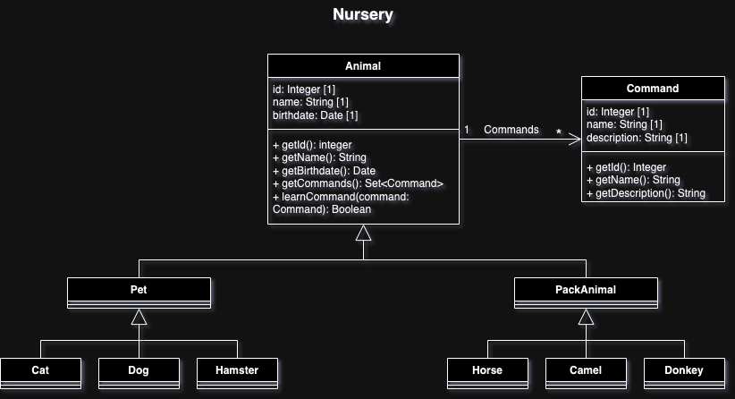
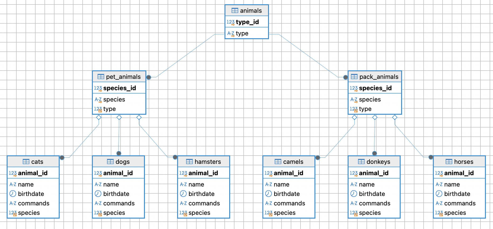

## Система учета для питомника в котором живут домашние и вьючные животные

### Подготовка среды
1. Устанавливаем VirtualBox на хостовую машину Mac OS (Sonoma)
2. Устанавливаем дитстрибутив Linux - Ubuntu-desktop 24.04
3. Конфигурируем сеть в настройках виртуальной машины на тип подключения NAT и перенаправаляем порты для подключения по SSH с хостовой машины
4. Устанавливаем систему контроля версий git и SSH. Генерируем ключи для Ubuntu и добавляем публичный ключ в рабочий аккаунт GitHub
5. Подключаемся к гостевой ОС по SSH
6. *Опционально можно сконфигурировать клиентскую и серверную машину на проброс X11 сервера для работы с удаленным дисплеем

```
alex@iMac-IMAC ~ % ssh -p 8022 alex@localhost
alex@localhost\'s password:
alex@alex-VirtualBox:~$
``` 
`alex@alex-VirtualBox:/...$` далее `~$`

Создание рабочей директории проекта, локального репозитория системы контроля версий и подключение удаленного репозитория

```
~$ mkdir GeekBrains_prog_spec_final_test
~$ cd ./GeekBrains_prog_spec_final_test/
~/GeekBrains_prog_spec_final_test$ git init
```

Создаем README.md и делаем инициализирующий коммит, переименовываем главную ветку в main

```
~$ echo "# gb_programming_specialization_final_test" >> README.md
~$ git add README.md
~$ git branch -M main
~$ git remote add origin git@github.com:Aberezhnoy1980/gb_programming_specialization_final_test.git
~$ git push -u origin main
~$ git checkout -b files_creating
```

Создаем ветку для работы с текущим заданием и переходим на нее

## Операционные системы и виртуализация (Linux)

### 1. Использование команды cat в Linux
- Создать два текстовых файла: "Pets"(Домашние животные) и "Pack animals"(вьючные животные), используя команду `cat` в терминале Linux. 
В первом файле перечислить собак, кошек и хомяков. Во втором — лошадей, верблюдов и ослов.

```
~$ cat > Pets
~$ cat > Pack_animals
```
- Объединить содержимое этих двух файлов в один и просмотреть его содержимое.
- Переименовать получившийся файл в "Human Friends"
  
```
~$ cat Pets Pack_animals > Human_friends
~$ cat Human_friends
~$ ls -lh
итого 16K
-rw-rw-r-- 1 alex alex 1,2K авг  5 17:07 Human_friends
-rw-rw-r-- 1 alex alex  607 авг  5 16:53 Pack_animals
-rw-rw-r-- 1 alex alex  608 авг  5 17:05 Pets
-rw-rw-r-- 1 alex alex   43 авг  5 14:12 README.md
```

### 2. Работа с директориями в Linux
- Создать новую директорию и переместить туда файл "Human Friends".

`~$ mkdir animals && mv Human_friends ./animals`

Для удобства установим утилиту tree (sudo apt install tree)
```
~/GeekBrains_prog_spec_final_test$ tree
.
├── animals
│	 └── Human_friends
├── Pack_animals
├── Pets
└── README.md
```
2 directories, 4 files

Делаем коммит, пушим изменения, создаем ПР, мерджим ветки и удаляем текущую

### 3. Работа с MySQL в Linux. “Установить MySQL на вашу вычислительную машину ”
- Подключить дополнительный репозиторий MySQL и установить один из пакетов из этого репозитория.

Создадим и добавим ключ GnuPG. Создадим в корне файл `mysql_pubkey.asc` и вставим публичную часть ключа скопированную с оф сайта документации mysql (предварительно установив редактор vim и проверив утилиту gpg (`gpg --help`))

```
~$ cd ~
~$ vim mysql_pubkey.asc
```

Импортируем ключ в связку ключей GnuPG

`~$ gpg --import mysql_pubkey.asc`

Добавим ключ в связку ключей GnuPG

`~$ sudo apt-key add ./mysql_pubkey.asc`

Подключим репозиторий mysql вручную путем создания файла `mysql.list` в директории `/etc/apt/sourses.list.d`

`~$ cat /etc/apt/sources.list.d/mysql.list`

Версия ubuntu - 24.04 LTS noble (проверяем codename версии `cat /etc/os-release`.)

`deb http://repo.mysql.com/apt/ubuntu/ noble mysql-8.0 mysql-tools`

Обновыим информацию о пакете из репозитория

`~$ sudo apt update`

Устанавливаем сервер БД

`sudo apt install mysql-server`

Проверяем подключение и получаем приглашение сервера. Проверяем базы данных

```
~$ mysql -u root -p 
Enter password: 
Welcome to the MySQL monitor.  Commands end with ; or \g.
Your MySQL connection id is 9
Server version: 8.0.39 MySQL Community Server - GPL

Copyright (c) 2000, 2024, Oracle and/or its affiliates.

Oracle is a registered trademark of Oracle Corporation and/or its
affiliates. Other names may be trademarks of their respective
owners.

Type 'help;' or '\h' for help. Type '\c' to clear the current input statement.

mysql> show databases;
+--------------------+
| Database           |
+--------------------+
| information_schema |
| mysql              |
| performance_schema |
| sys                |
+--------------------+
4 rows in set (0,00 sec)
```

### 4. Управление deb-пакетами
- Установить и затем удалить deb-пакет, используя команду `dpkg`.

Скачиваем пакет (для примера connector)

`alex@alex-VirtualBox:`~$ sudo apt download mysql-connector-j`

Проверяем файл

```
alex@alex-VirtualBox:`~$ ll | grep mysql-c
-rw-r--r--  1 root root 2522418 июн 28 05:23 mysql-connector-j_9.0.0-1ubuntu24.04_all.deb
```

Устанавливаем пакет с помощью менеджера dpkg

`~$ sudo dpkg -i mysql-connector-j_9.0.0-1ubuntu24.04_all.deb`

Удаляем пакет 

```
alex@alex-VirtualBox:~$ sudo dpkg -r mysql-connector-j && sudo apt autoremove
alex@alex-VirtualBox:~$ rm mysql-connector-j_9.0.0-1ubuntu24.04_all.deb
```

Создаем новую ветку для записи истории команд в файл и добавления файла в проект

```
~$ cd ./GeekBrains_prog_spec_final_test/
$ git checkout -b command_list_and_mysql_task
```

### 5. История команд в терминале Ubuntu
- Сохранить и выложить историю ваших терминальных команд в Ubuntu.
В формате: Файла с ФИО, датой сдачи, номером группы(или потока)

Перенаправим вывод команды history в файл (можно использоваать ключи, например -anrw)

```
$ history > Berezhnoy_A_09082024_5449
alex@alex-VirtualBox:~$ ll ./GeekBrains_prog_spec_final_test
```

Фиксируем изменения в системе контроля версий (далее отдельные ветки создавать не будем, коммитить будем ветку main (разработчик один и потребности в Pull request пока нет))

## Объектно-ориентированное программирование 

### 6. Диаграмма классов
- Создать диаграмму классов с родительским классом "Животные", и двумя подклассами: "Pets" и "Pack animals".
В составы классов которых в случае Pets войдут классы: собаки, кошки, хомяки, а в класс Pack animals войдут: Лошади, верблюды и ослы.
Каждый тип животных будет характеризоваться (например, имена, даты рождения, выполняемые команды и т.д)
Диаграмму можно нарисовать в любом редакторе, такими как Lucidchart, Draw.io, Microsoft Visio и других.

Нарисуем диаграмму с помощью вэб-сервиса draw.io и импортируем изображение в папку проекта. 



Зафиксируем добавленый артефакт в системе контроля версий
```
~$ cp ~/shared/Nursery_class_diagram.drawio ./img
~$ cp ~/shared/Nursery_class_diagram.png ./img
~$ ls -l ./img
итого 132
-rwxrwx--- 1 alex alex  15948 сен 19 11:01 Nursery_class_diagram.drawio
-rwxrwx--- 1 alex alex 117164 сен 19 11:02 Nursery_class_diagram.png
~$ git add -A; git commit -m"class diagram adedd"; git push origin main
 ```

### 7. Работа с MySQL (Задача выполняется в случае успешного выполнения задачи “Работа с MySQL в Linux. “Установить MySQL на вашу машину”)

7.1. После создания диаграммы классов в 6 пункте, в 7 пункте база данных "Human Friends" должна быть структурирована в соответствии с этой диаграммой. Например, можно создать таблицы, которые будут соответствовать классам "Pets" и "Pack animals", и в этих таблицах будут поля, которые характеризуют каждый тип животных (например, имена, даты рождения, выполняемые команды и т.д.). 

7.2   - В ранее подключенном MySQL создать базу данных с названием "Human Friends".
- Создать таблицы, соответствующие иерархии из вашей диаграммы классов.
- Заполнить таблицы данными о животных, их командах и датами рождения.
- Удалить записи о верблюдах и объединить таблицы лошадей и ослов.
- Создать новую таблицу для животных в возрасте от 1 до 3 лет и вычислить их возраст с точностью до месяца.
- Объединить все созданные таблицы в одну, сохраняя информацию о принадлежности к исходным таблицам.

Вот здесь есть разночтения в ТЗ в части создания таблиц: в тексте сказано создавать таблицы согласно диагрммы классов в том числе один из  пунктов явно указывает "..Удалить записи о верблюдах и объединить **ТАБЛИЦЫ** лошадей и ослов.", то есть у каждого вида животного есть своя таблица (коты, собаки и пр.), однако в примере минимальная таблица на уровне типа животного (домашние, вьючные) с указанием вида в кортеже (кот, собака и т.д.). 
Запускаем mysql cli и получаем приглашение сервера:

alex@alex-VirtualBox:~$ mysql -u root -p
mysql> show databases;
+--------------------+
| Database           |
+--------------------+
| information_schema |
| mysql              |
| performance_schema |
| sys                |
+--------------------+
4 rows in set (0,00 sec)

Структура таблиц после создания:



Установим Docker

`~$ sudo apt update`

Установим пакеты, которые позволят использовать репозиторий по HTTPS:

`~$ sudo apt install apt-transport-https ca-certificates curl software-properties-common`

Устновим официальный GPG-ключ Docker:

`~$ sudo mkdir -p /etc/apt/keyrings curl -fsSL https://download.docker.com/linux/ubuntu/gpg | sudo gpg --dearmor -o /usr/share/keyrings/docker-archive-keyring.gpg`

Добавим репозиторий Docker к списку источников пакетов:

`~$ echo "deb [signed-by=/usr/share/keyrings/docker-archive-keyring.gpg] https://download.docker.com/linux/ubuntu $(lsb_release -cs) stable" | sudo tee /etc/apt/sources.list.d/docker.list > /dev/null`

Обновим пакеты

`~$ sudo apt update`

Установимк компоненты

`~$ sudo apt-get install docker-ce docker-ce-cli containerd.io docker-compose-plugin`

Добавим пользователя в группу docker, чтобы избежать использования sudo для запуска Docker команд:
```
~$ sudo usermod -aG docker $USER
~$ newgrp docker
~$ docker --version
```

Тестируем

`~$ sudo docker run hello-world`

Создаем директокрию проекта

## 8. ООП и Java

### Подготовка среды исполнения - пишем программу в коммандной строке

Установим jdk

```
~$ sudo apt update
~$ sudo apt install openjdk-17-jdk
```

Установим сборщик Maven

`~$ sudo apt install mvn`

Проверим окружение

```
~$ mvn --version
Apache Maven 3.8.7
Maven home: /usr/share/maven
Java version: 17.0.12, vendor: Ubuntu, runtime: /usr/lib/jvm/java-17-openjdk-amd64
Default locale: ru_RU, platform encoding: UTF-8
OS name: "linux", version: "6.8.0-40-generic", arch: "amd64", family: "unix"
```

Создадим модульный проект из архитепа

```
mvn archetype:generate -DgroupId=ru.aberezhnoy \
-DartifactId=java-repeat \
-DarchetypeArtifactId=maven-archetype-quickstart \
-DarchetypeVersion=1.4 \
-DinteractiveMode=false
```

mvn dependency:tree
mvn package –Dmaven.test.skip=true
mvn -DskipTests=true package

#   - Создать иерархию классов в Java, который будет повторять диаграмму классов созданную в задаче 6(Диаграмма классов) .

# 9. Программа-реестр домашних животных
#    - Написать программу на Java, которая будет имитировать реестр домашних животных. 
# Должен быть реализован следующий функционал:
    
# 9.1. Добавление нового животного
#     - Реализовать функциональность для добавления новых животных в реестр.       
#     Животное должно определяться в правильный класс (например, "собака", "кошка", "хомяк" и т.д.)
# 9.2. Список команд животного
#     - Вывести список команд, которые может выполнять добавленное животное (например, "сидеть", "лежать").
# 9.3. Обучение новым командам
#     - Добавить возможность обучать животных новым командам.
# 9.4 Вывести список животных по дате рождения
# 9.5. Навигация по меню
#     - Реализовать консольный пользовательский интерфейс с меню для навигации между вышеуказанными функциями.
        
# 10. Счетчик животных
# Создать механизм, который позволяет вывести на экран общее 
# количество созданных животных любого типа (Как домашних, так и 
# вьючных), то есть при создании каждого нового животного счетчик 
# увеличивается на “1”. 